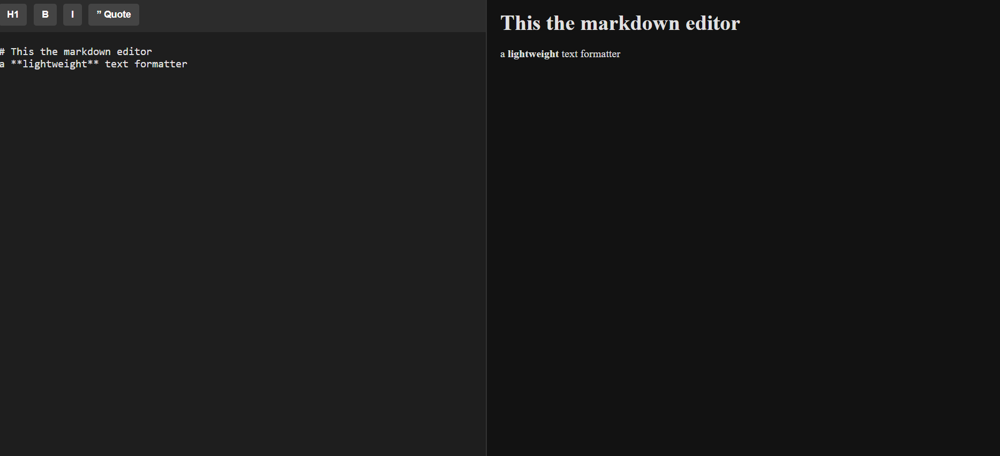

# Live Markdown Editor 🚀

> A lightweight, real-time Markdown compiler with a built-in formatting toolbar and a sleek dark-mode UI.

## 🔗 Live Demo
[Click here to view the live application](#) *(Link coming soon!)*

## 📸 Sneak Peek
 

## ✨ Core Features
* **Custom Formatting Toolbar:** Engineered a UI toolbar that programmatically injects Markdown syntax into user-selected text, bypassing the need for manual symbol typing.
* **Real-Time Data Binding:** Utilized JavaScript event listeners and the DOM to instantly compile raw text into styled HTML on every keystroke.
* **Premium Dark-Mode UI:** Designed a responsive, split-pane layout using modern CSS Flexbox, optimized for a professional developer experience.

## 🛠️ Tech Stack
* **HTML5** (Semantic structure, Selection API)
* **CSS3** (Flexbox, custom UI styling)
* **Vanilla JavaScript** (String manipulation, Regex parsing, Event dispatching)

## 🧠 What I Learned
Building this project was a massive leap in my understanding of string manipulation and real-time DOM updates. My biggest breakthrough was demystifying Regular Expressions (Regex). Instead of memorizing syntax, I learned how to use capture groups and JavaScript's `.replace()` method to build a custom parsing engine. 

Additionally, I learned how to handle complex UI interactions by leveraging the HTML5 Selection API (`selectionStart` and `selectionEnd`) to precisely target highlighted text. Finally, to ensure the preview updated seamlessly when using the toolbar buttons, I mastered programmatic event dispatching (`dispatchEvent`) to manually trigger input listeners.